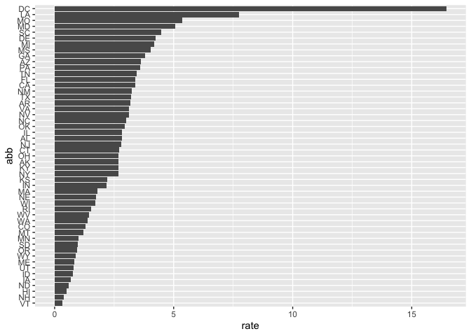

Report On Gun Murders
================
Arsh Bawa
27/04/2020

## Introduction

This is a report on 2010 gun murder rates obtained from FBI reports. The
original data was obtained from [this wikipedia
page](https://en.wikipedia.org/wiki/Murder_in_the_United_States_by_state).

We are going to use the following library:

``` r
library(tidyverse)
```

and load the data we already wrangled:

``` r
load('rdas/murders.rda')
```

# Murder rate by state

We note the large state to state variability by generating a barplot
showing the murder rate by state

<!-- -->
